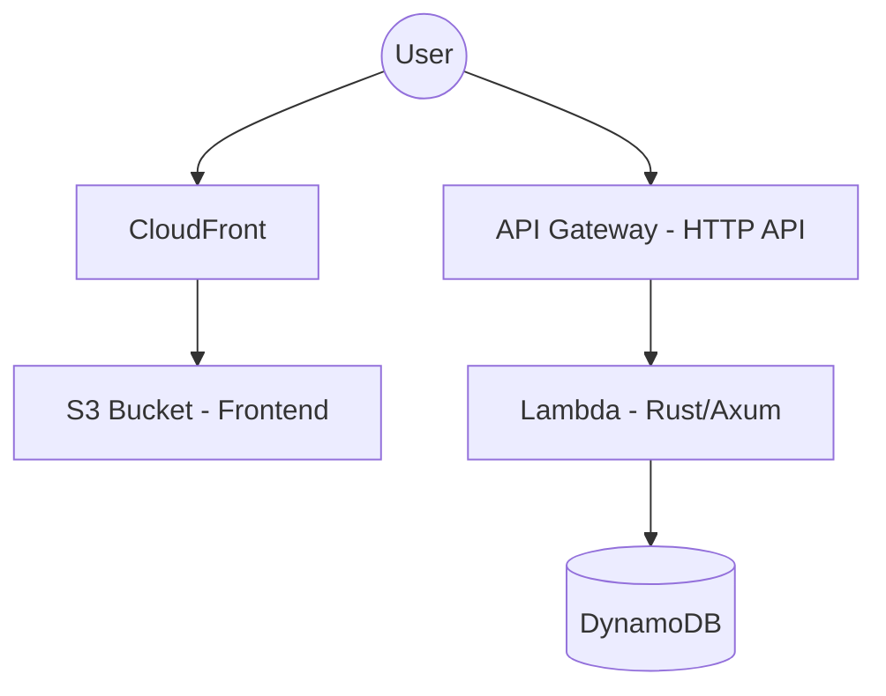

# **Project: Dumbbell Pro Log (AWS Serverless & AI-Native)**

## **1. 概要 (Executive Summary)**

本プロジェクトは、ダンベルを用いた自重・フリーウェイトトレーニング（特にPPLルーチン）を最短のタップ数で記録し、ユーザーを次のセットへ「オートパイロット」で導くためのモバイル特化型Webアプリである。

## **2. 実装済み要件 (Implemented Requirements)**

### **2.1 機能要件**

*   **順次トレーニング表示**: 「Push Day」ルーチンを実装。1種目ずつ表示し、セット完了後に自動遷移。
*   **2ステップ・ロギング**:
    1.  レップ数（8-15のグリッド）を選択。常時選択状態を維持。
    2.  RPE（自覚的運動強度：余裕・妥当・限界）を選択。
*   **オート・インターバル**: RPE選択後、即座に90秒のレストタイマーを起動。スキップ可能。
*   **プログレス表示**: セッション全体の進捗を上部のバーで可視化。
*   **履歴とボリューム**: セッション内の履歴表示と、総挙上重量（Total Volume）の自動算出。
*   **永続化**: `localStorage` を使用した「Offline First」な状態保持。

### **2.2 非機能要件**

*   **AWS Serverless**: API Gateway (HTTP API), Lambda (Rust), DynamoDB, S3 + CloudFront (Hosting)。
*   **Stack**:
    *   **Backend**: Rust (Axum + lambda_http)
    *   **Frontend**: React + Tailwind CSS v4 (TypeScript)
    *   **Infrastructure**: AWS CDK v2 (TypeScript)
*   **Optimizations**:
    *   CloudFront Price Class 200 (日本を含む主要地域への低コスト配信)。
    *   Pixel 9 に最適化されたレスポンシブデザイン（セーフエリア対応）。

## **3. システム設計 (System Design)**

### **3.1 アーキテクチャ (Architecture)**



### **3.2 データモデル (Shared Schema)**

```rust
pub enum RpeLevel { Easy, Just, Limit }

pub struct WorkoutSet {
    pub user_id: String,
    pub timestamp: String,
    pub exercise_id: String,
    pub weight: f32,
    pub reps: u32,
    pub rpe: RpeLevel,
}
```

## **4. プロジェクト構造 (Project Structure)**

*   `/frontend`: Reactアプリケーション
*   `/backend`: Rust APIサーバー
*   `/infra`: AWS CDK インフラ定義
*   `build_and_deploy.sh`: ビルド・デプロイ自動化スクリプト